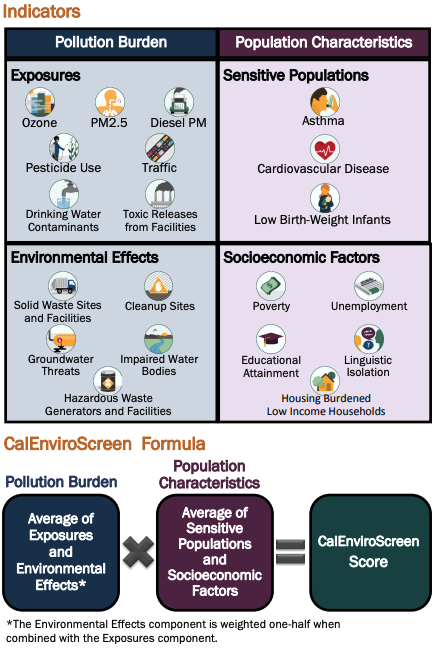
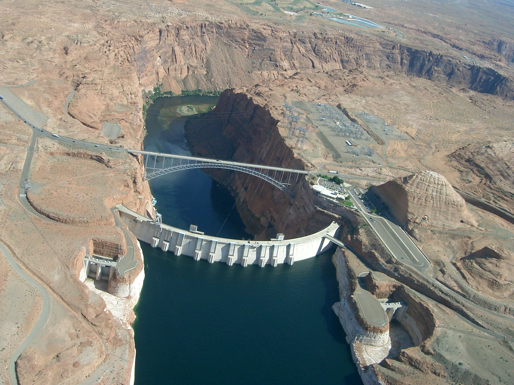

# USDOI Economics Community of Practice 2021 Python Training

Welcome to the USDOI Economics Community of Practice Python Training (virtual edition again!)  for 2021!

This year, we have two examples to explore and rather than installing python locally, we will run in binder - a cloud-based service. The good news is, no painful installation. The bad news is, storage is not persistent so you will have to save your work locally to keep things (more on that as we go)

# To activate the environment, click the 'launch' button below. First time it can take a few minutes

# Examples
_Disclaimer: The data used in these examples are real, but the analysis is naive - simply focused on illustrating the uses of python and not to draw formal conclusions_

## 0) Environmental Justice
This exercise was motivated by an NPR [Science Friday](https://www.sciencefriday.com/educational-resources/environmental-justice-evaluating-zip-codes-and-pollution-burdens/) episode discussing, among other things, a [dataset](https://oehha.ca.gov/calenviroscreen) and [decision tool](https://oehha.ca.gov/calenviroscreen/report/calenviroscreen-30) in California to evaluate propensity for pollution exposure and demographics -- particular those based on race and socieconomic factors -- as potentially correlated. A fact sheet documents the decision tool call [CalEnviroScreen](https://oehha.ca.gov/media/downloads/calenviroscreen/fact-sheet/ces30factsheetfinal.pdf). A more detailed report on the methodology is [here](https://oehha.ca.gov/media/downloads/calenviroscreen/report/ces3report.pdf).  

In this exercise, we take advantage of `pandas` and `geopandas` to explore tabular and spatial data, merge datasets from shapefiles and Excel files, calculate correlation between potential predictors and pollution metrics, and make graphics summarizing the results for deeper analysis.

## 1) Glen Canyon Dam and the Colorado River
This exercise leverages the ability of python, using `pandas` and other packages, to download USGS water data on the Colorado River from the National Water Information System ([NWIS](https://waterdata.usgs.gov/nwis?)) to explore the changes -- intentional and potentially not intentional -- to river flow in the Colorado River entering the Grand Canyon due to construction and operation of the Glen Canyon Dam in the 1960s. In particular, the implementation of the [Colorado River Compact](https://en.wikipedia.org/wiki/Colorado_River_Compact) motivates exploration. The NWIS river flow records at [Lees Ferry](https://waterdata.usgs.gov/usa/nwis/uv?09380000) and in the [Grand Canyon](https://waterdata.usgs.gov/usa/nwis/uv?site_no=09402500) are continuous from the 1920s providing a rich dataset to explore qualitatively and quantitatively.

### Brought to you by our Mascot, who may or may not join us this year

## Optional local installation instructions if you want to really get started with Python

0. Download [Miniconda](https://docs.conda.io/en/latest/miniconda.html) for your current operating system
1. Create the same environment we are using in the tutorial but doing the following:  
    a. Download this entire repository as a zipfile from the green "CODE" button above (you can choose Download zip)  
    b. On Windows open a Miniconda Prompt from your start menu (on Mac or Linux, open a terminal)  
    c. Navigate to the "binder" directory  
    d. type `conda env create -f environment.yml` and answer "y" to a couple questions  
    e. activate the environment by typing `conda activate econ21`  
    f. Program and enjoy!